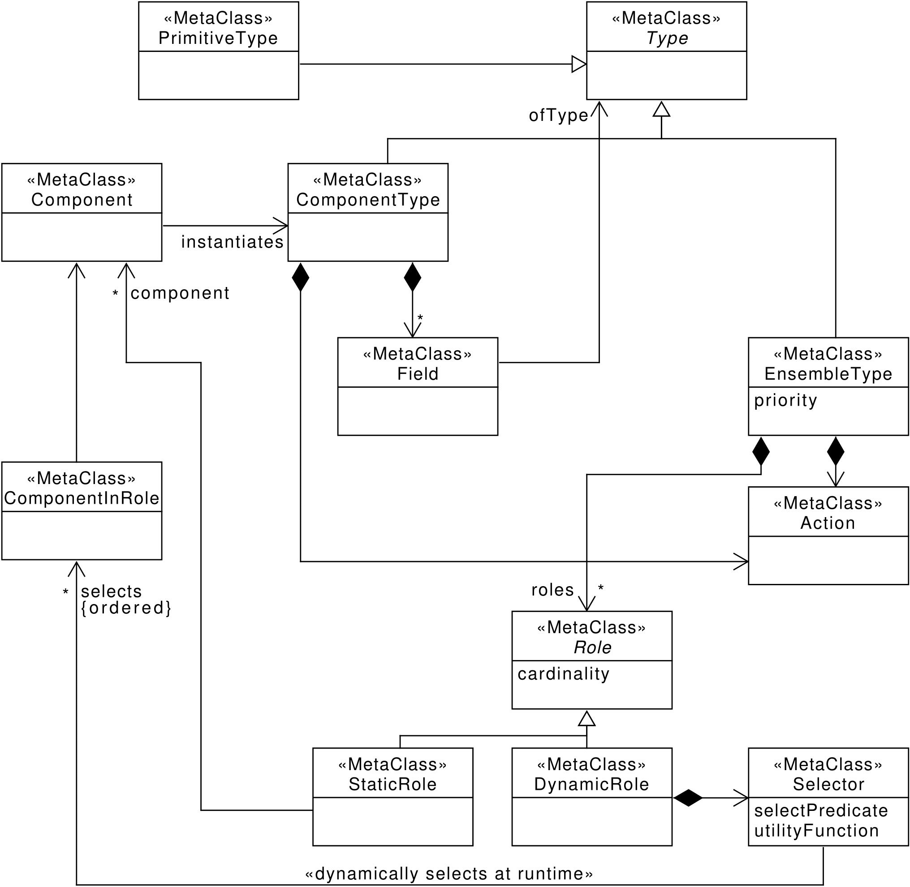
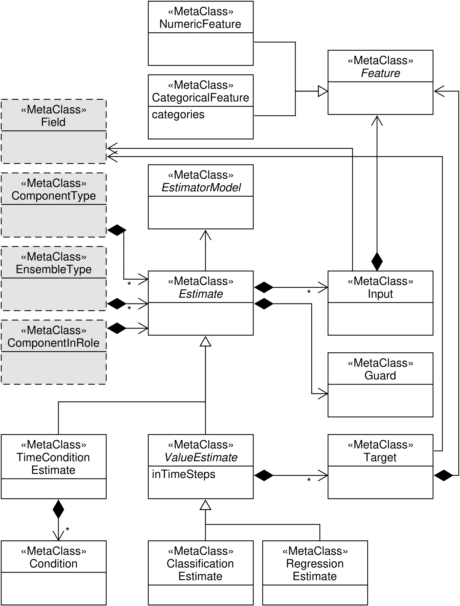
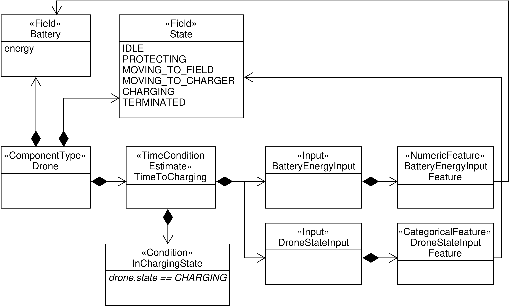

# ML-DEECo: Machine Learning-enabled Component Model for Dynamically Adapting Systems

This is an accompanying repository to the paper *ML-DEECo: Machine Learning-enabled Component Model for Dynamically Adapting Systems* by Milad Abdullah, Michal Töpfer, Tomáš Bureš, Petr Hnětynka, Martin Kruliš, and František Plášil.

It also serves as a replication package for Master thesis *Machine-learning-based self-adaptation of component ensembles* by Michal Töpfer.

## Contents

There are several folders in this repository:

* [`ml_deeco`](ml_deeco) &ndash; implementation of the ML-DEECo framework.
* [`ml_deeco/examples`](ml_deeco/examples)
  * [`simple_example`](ml_deeco/examples/simple_example) &ndash; a simple example showing basic usage of the ML-DEECo framework.
  * [`all_example`](ml_deeco/examples/all_example) &ndash; example of all predictions defined in the taxonomy (serves mainly as a test of the implementation).
* [`drone_charging_example`](drone_charging_example) &ndash; the example showcased throughout the paper (with a replication package).
* [`meta-models`](meta-models) &ndash; figures included in this readme.

Furthermore, this readme file contains supplementary content to the paper:

* [Estimators semantics and meta-models](#estimators-semantics-and-meta-models)
* [Limitations and Threats to Validity](#limitations-and-Threats-to-Validity)

## Estimators semantics and meta-models

In this section, we show how to integrate the ability to make predictions and use them in the meta-model of an ensemble-based component model.

We start with a (simplified due to the space constraints) meta-model describing core concepts of components and ensembles from the DEECo ensemble-based component model [B2013].

Now we show the meta-model of the concepts discussed in Sections 3.A and 3.B of the paper and how they are incorporated to DEECo (technically, this meta-model is a package that extends the core meta-model &ndash; the gray dashed elements are defined in the core meta-model).

The core element is the `Estimate`, which represents values to be learned together with all the necessary inputs, guards, etc.
Following the "where" dimension, the `Estimate` can be attached to a component (each component can have multiple `Estimate`s &ndash; each for a different data field), an ensemble, or a pair ensemble-component.

The `Estimate` itself is parameterized by the `EstimatorModel`, which defines parameters for the underlying neural network and thus the estimate implementation and behavior.
Each `Estimate` can have multiple `Input`s (training features), i.e., fields of the component needed for training and prediction. We distinguish here between numerical and categorical features, which influences whether the value is used as-is (possibly normalized) or whether one-hot encoding (in the case of categorical features) is used.

The `Estimate` is further specialized to distinguish between the options in the "what" dimension. In the *value* case (represented by subclass `ValueEstimate`), it specifies a target, which denotes the truth values that are to be predicted by the estimator. This can be either numerical or categorical value computed based on the component fields. For numerical values, we use the `RegressionEstimate` subclass of `ValueEstimate`, and for categorical values, we use the `ClassificationEstimate`. The number of time steps we want to predict into the future is set by the `inTimeSteps` attribute of `ValueEstimate`.

For the *time-to-condition* case, there is another subclass of `Estimate` &ndash; `TimeToConditionEstimate` &ndash; which specifies a required condition.

The `Estimate` further defines a guard predicate (over component fields), which determines if inputs and outputs (i.e., the target feature or the result of the condition) are valid and thus can be used to collect data for training the estimator.

Such a description of an estimator is enough for automated data collection and training. The semantics of the modeling concepts in the data collection phase is as follows. 

In the case of the `ValueEstimate`, we perform the following actions in every time step:

* We collect the inputs and the current time provided that the guard condition on inputs is true.
* We collect the outputs (represented by class `Target`), provided that the guard condition on the output is true. We associate the output with inputs that were collected `inTimeSteps` time steps ago. If the guard condition on the output is false, we discard the inputs recorded `inTimeSteps` time steps ago.

In case of the `TimeToConditionEstimate`, we perform the following action in every time step:

* We collect the inputs and the current time to a buffer provided that the guard condition on inputs is true.
* If the condition specified by the `Condition` is true, we
associate all the inputs collected in the buffer (as per step \#1) with the difference between the current time and the time of the input in the buffer. We clear the buffer.

### Examples

#### Component

To illustrate the concepts, we show an instance of the meta-model for the drone component of the running example.

The drone has two fields &ndash; `Battery` containing the current state of battery energy and `State` expressing the current operational state of the drone.
The drone has attached a single `TimeToConditionEstimate` predicting how long it will take for the drone to get into the `CHARGING` state (thus the `Condition` is a simple predicate checking equality of the `State` to the `CHARGING` value).
The estimate has two inputs &ndash; `BatteryEnergyInput` and `DroneStateInput` (the former of the numeric kind while the latter of the categorical kind).

Similarly, in the running example, the drone has the `RegressionEstimate` for predicting battery energy.

#### Ensemble

We also show an instance of the `EnsembleType` &ndash; particularly the `DroneChargingAssignment`, which groups and coordinates drones waiting for a given charger.

It has a single static role for an associated `Charger` (with cardinality $1$) and a single dynamic role `Drones` (for the grouped drones) with the multiple cardinality without any upper limit (i.e., it can possibly group all the available drones). 
The selector of the role selects drones that are in need of charging.
As the cardinality is unlimited, there is no utility function defined (as all the drones can be assigned to the role).

## Limitations and Threats to Validity

We list the most important ones below. We organize the threats to validity based on the schema in [RH2009], where the validity classes are defined as follows:
 * construct validity,
 * internal validity,
 * external validity, and
 * reliability.

*Construct validity:* We construct our validation on the assumption that by providing the data collection and ML, the ML-DEECo framework saves coding effort for the types of predictions identified in the paper in Section III.A. This could potentially be false, though we did our best to make the meta-model and the corresponding Python API easy to use. Also, we provide several examples that show that different predictors can indeed be easily deployed just with a couple of lines in Python.

*Internal validity:* To show that the framework has the potential to improve self-adaptive systems by introducing ML-based estimation, we made the experiment described in the paper in Section IV.C. We use two metrics as a measure of the improvement: the total amount of damaged crops and the number of drones that did not run out of battery till the end of the simulation. A potential threat here is that there is a hidden unknown factor that has a significant influence on the results. We mitigated this threat by the following: (1) We used exactly the same component and ensemble definitions for both the baseline and the ML-based architecture; the only difference was the value of the `waitingTime`, which was set to 0 in the baseline and to the value of the estimator in the ML-based solution. (2) We made several experiments in which we varied individual parameters of the simulation and observed the effect on these metrics to ensure that we did not see any unexpected or random effects. 

*External validity:* We attempted to ensure our solution is general by basing it on the taxonomy of predictions (Section III.A}), which is independent of our running example and is built as a combination of generally accepted abstractions. However, the use case we show and the simulation we did cannot by themselves guarantee generalizability. They serve rather as proof of feasibility. To show the full generalizability of our results, we would have to apply our approach on larger case studies. This is beyond the scope of this paper and constitutes future work.

*Reliability:* Though coming from an EU project with multiple partners, the implementation of the use-case we used for demonstration was created by us, including the baseline and the ML-based solution. This makes our results dependent on us. We ensured the difference between the baseline and the ML-based solution is only in the use of the estimator. However, this still makes our results only an indicator of the potential improvement and a feasibility case. They do not permit quantification of an expected improvement in other applications.

[RH2009]  P. Runeson and M. Höst, “Guidelines for conducting and reporting case study research in software engineering,” Empirical Software Engineering, vol. 14, no. 2, pp. 131–164, Apr. 2009.

[B2013] Tomas Bures, Ilias Gerostathopoulos, Petr Hnetynka, Jaroslav Keznikl, Michal Kit, and Frantisek Plasil. 2013. DEECO: an ensemble-based component system. In Proceedings of the 16th International ACM Sigsoft symposium on Component-based software engineering (CBSE '13). Association for Computing Machinery, New York, NY, USA, 81–90. DOI:https://doi.org/10.1145/2465449.2465462
