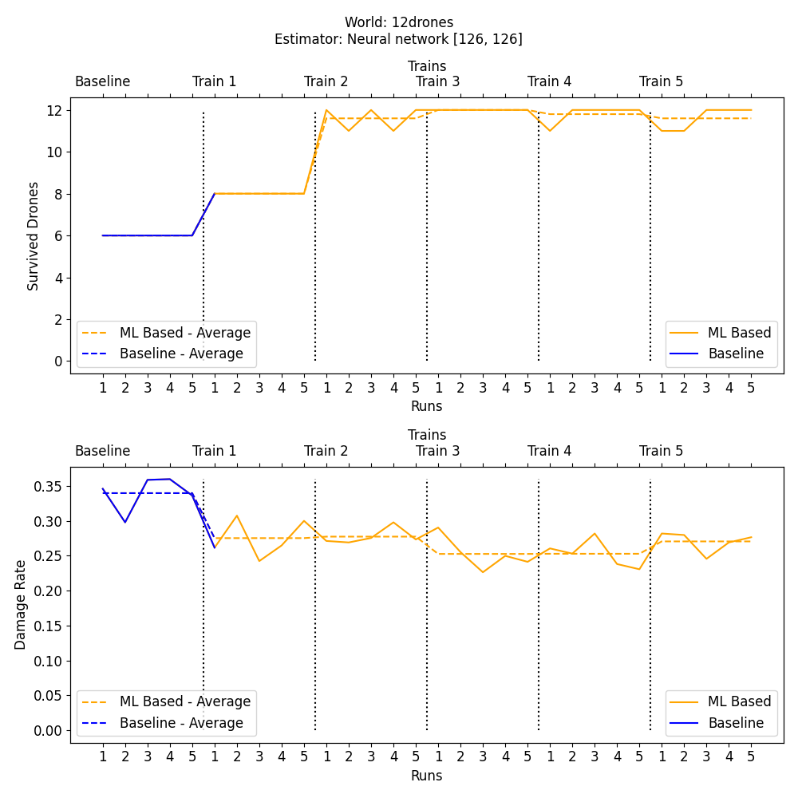

# Drone Charging Example
In this broad example, we provide a simulation that runs a system which protects field of corps against flocks of birds, using virtual drones. In this document, a complete guide to run the example is presented:

- [Installation](#installation)
- [Usage](#usage)
- [YAML Experiments](#yaml-experiments)
- [Collecting Results](#results)
- [Limitations](#limitations)


## Installation
To run the example, some libraries must be installed. The installation requires `Python 3` and `pip`. If you have `pip` installed skip to - [Package Installation](#package-installation).

To install `pip` follow the following instructions:

### Install pip on Debian/Ubuntu 
```
apt install python3-pip            
```
### Install pip on Debian/Ubuntu
```
apt install python3-pip
```
### Install pip on CentOS, RHEL, Fedora
```
yum -y update
yum install python-pip
```
### Install pip on Arch Linux
```
pacman -S python-pip
```
### Install pip on openSUSE
```
zypper install python3-pip
```
### Install pip on Windows
First download https://bootstrap.pypa.io/get-pip.py and copy/save it in a folder. Then run the following command:
```
python <path-to-get-pip.py>/get-pip.py
```
### Package Installation
All the required packages and libraries are stored in [requirements.txt](requirements.txt).
> :warning: the requirements include **Tensorflow**, and the size of its dependencies could reach **1.5 GB**

#### Step 1: install all the packages by running the following command:
```
pip install -r requirements.txt
```
#### Step 2: install ML-DEECo using `pip` (the `--editable` switch can be omitted if one does plan to change the code of ML-DEECo):
```
pip install --editable ../ml_deeco
```

## Usage
The simulation is configured with a YAML file, a few examples could be found in [experiments](/experiments/). The results will be stored in results folder. For a quick run, simply execute the following command:

```
py run.py experiments/12drones.yaml
```

The above command runs the simulation once and store the results in results folder. To run the simulation multiple times use `-n <NUMBER>`, and to view a chart at the end of run, use `-c`.


```
py run.py experiments/12drones.yaml -n 5 -c
```

Please note that the simulation will not train unless `t <NUMBER>` is set, and it must be set more than 1. To Observe the outcomes during runtime, one can use `-v <NUMBER>` where it sets the verboseness between 0-4. The following command will run 12drones.yaml 5 times per trainings. Therefore it will run and collect the results of total of 15 simulation runs, with verboseness level of 2. The first training runs will use no estimation at all.

```
py run.py experiments/12drones.yaml -n 5 -t 4 -v 2 -c
```

The above command will relatively spend more time to finalize and store the results. Should the YAML file not chang, the graph will look like the following one:


For a better training and accumulation of all data, use `-d `, which might probably take more time than previous command. Additionally one might try the experiment with different test split (using `--test_split <RATE>`), different hidden layers (using `--hidden_layers [<NUMBER>,<NUMBER>]`) or a random seed (using `-s <NUMBER>`). To specify a subfolder in results to store all the results use `-o <PATH>`; if the folder does not exist it will be created.

```
py run.py experiments/12drones.yaml -n 5 -t 6 -d -o test_12_drones --hidden_layers 126 126 -c --test_split 0.4 --seed 423
```
> The above command will run the experiments 30 Times (n X t), train every 5 times accumulating all data, saving 6 models in results/test_12_drones/neural_network folder. The model will have [126,126] hidden layers, splitting 40% data for validation and the random seed to initialize random objects is 4232. The below chart shows the results:


It could be observed that with tunning neural network parameters, the outcome varies and it could be improved. The models are stored in the results/test_12_drones/neural_network as `h5` files. They are portable models that could be used with the same simulation (using `-l <PATH-TO-MODEL>`), but perhaps with different size of folks (overriding the YAML configuration with `-x <NUMBER>`). Additionally, a visualizer is attached to the simulation and it can be toggled with `-a`.
> :warning: using *`-a`* with multiple runs will produce GIF animations for all of them, and it might take excessive storage and time.

```
py run.py experiments/12drones.yaml -l results/test_12_drones/neural_network/model_6.h5  -x 20 -a -o vis_12drones
```
The above command will produce animated scenario of the 12drone world. The file is located in vis_12drones/animations.


For further run options, 
<pre>
usage: run.py [-h] [-x BIRDS] [-n NUMBER] [-t TRAIN] [-o OUTPUT] [-v VERBOSE]
              [-a] [-c] [-w {baseline,neural_network}] [-d]
              [--test_split TEST_SPLIT]
              [--hidden_layers HIDDEN_LAYERS [HIDDEN_LAYERS ...]] [-s SEED]
              [-b BASELINE] [-l LOAD] [-e] [--threads THREADS]
              input
         

  -h, --help            show this help message and exit
  -x BIRDS, --birds BIRDS 
                        number of birds, if no set, it loads from yaml file.
  -n NUMBER, --number NUMBER
                        the number of simulation runs per training.
  -t TRAIN, --train TRAIN
                        the number of trainings to be performed.
  -o OUTPUT, --output OUTPUT
                        the output folder
  -v VERBOSE, --verbose VERBOSE
                        the verboseness between 0 and 4.
  -a, --animation       toggles saving the final results as a GIF animation.
  -c, --chart           toggles saving and showing the charts.
  -w {baseline,neural_network}, --waiting_estimation {baseline,neural_network}
                        The estimation model to be used for predicting charger
                        waiting time.
  -d, --accumulate_data
                        False = use only training data from last iteration.
                        True = accumulate training data from all previous
                        iterations.
  --test_split TEST_SPLIT
                        Number of records used for evaluation.
  --hidden_layers HIDDEN_LAYERS [HIDDEN_LAYERS ...]
                        Number of neurons in hidden layers.
  -s SEED, --seed SEED  Random seed.
  -b BASELINE, --baseline BASELINE
                        Constant for baseline.
  -l LOAD, --load LOAD  Load the model from a file.
  -e, --examples        Additional examples.
  --threads THREADS     Number of CPU threads TF can use.

  </pre>  

  ## YAML Experiments
  The experiment world configuration is fed by an YAML input file. To keep the variable domain in a manageable rate, most of tests were performed on the basis of similar world configurations, but changing number of drones, birds, charger and the capacity of charging rate. To view all configurations, refer to the following table.
